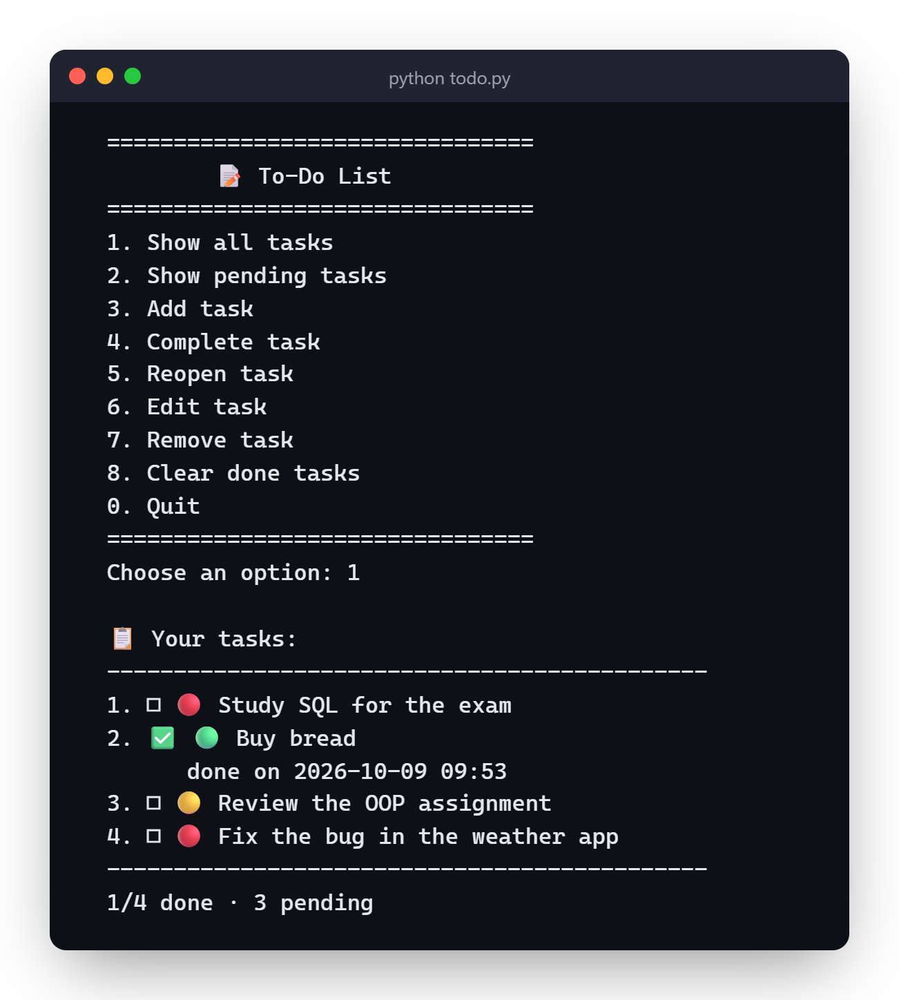

# To-Do List


A to-do list for the terminal, written in Python. It was one of my first projects.

You can add tasks with a priority (low, medium or high), mark them as done, reopen, edit, remove and clear the ones that are already done. Everything is saved to a `tasks.json` in the same folder as the script.

## How to use

```bash
git clone https://github.com/ViniciuscLemos/todo-list
cd todo-list
python todo.py
```

You don't need to install anything besides Python 3.

## What it looks like



The dot is the priority (red is high, yellow medium, green low). When picking the priority you can type `medium`, `Medium` or just the initial (`h`, `m`, `l`).

If `tasks.json` is corrupted or in a weird format, the program keeps a copy of it as `tasks.json.corrupted` and starts a new list instead of crashing. It also writes to a temp file before swapping it with the real one, so if the computer shuts down halfway through, the old list is still intact.

## Tests

```bash
python -m unittest discover -s tests
```
